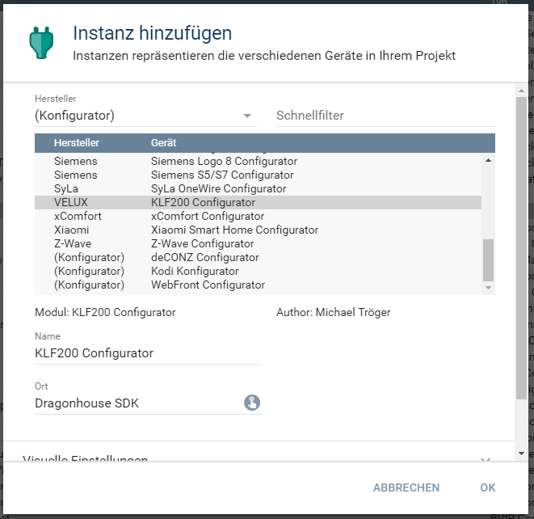
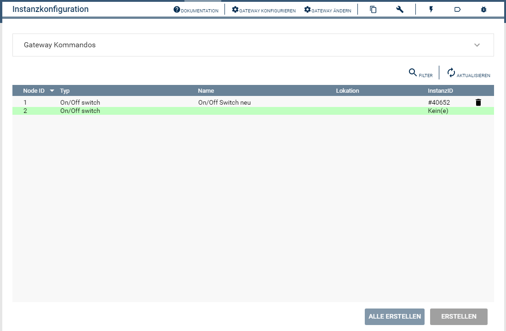
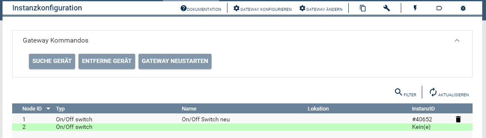
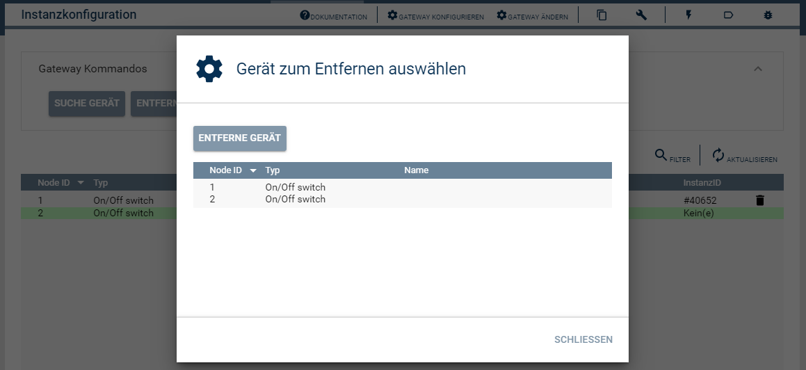

[](https://www.symcon.de/service/dokumentation/entwicklerbereich/sdk-tools/sdk-php/)
[](https://community.symcon.de/t/modul-velux-klf200/50429)
[](https://www.symcon.de/de/service/dokumentation/installation/migrationen/v55-v60-q3-2021/)  
[](https://creativecommons.org/licenses/by-nc-sa/4.0/)
[](https://github.com/Nall-chan/VeluxKLF200/actions) [](https://github.com/Nall-chan/VeluxKLF200/actions)  
[](#2-spenden)
[](#2-spenden)  

# Velux KLF200 Configurator  <!-- omit in toc -->

## Inhaltsverzeichnis <!-- omit in toc -->

- [1. Funktionsumfang](#1-funktionsumfang)
- [2. Voraussetzungen](#2-voraussetzungen)
- [3. Software-Installation](#3-software-installation)
- [4. Einrichten der Instanzen in IP-Symcon](#4-einrichten-der-instanzen-in-ip-symcon)
- [5. Statusvariablen und Profile](#5-statusvariablen-und-profile)
- [6. Gateway Kommandos](#6-gateway-kommandos)
- [7. PHP-Befehlsreferenz](#7-php-befehlsreferenz)
- [8. Aktionen](#8-aktionen)
- [9. Anhang](#9-anhang)
  - [1. Changelog](#1-changelog)
  - [2. Spenden](#2-spenden)
- [10. Lizenz](#10-lizenz)


## 1. Funktionsumfang

 - Auslesen und darstellen aller vom Gateway bekannten Geräte (Nodes).  
 - Einfaches Anlegen von neuen Instanzen in IPS.  
 - Anlernen und löschen von Nodes im Gateway.  

## 2. Voraussetzungen

 - IPS ab Version 6.0  
 - KLF200 io-homecontrol® Gateway  
    - KLF muss per LAN angeschlossen sein  
    - KLF Firmware 2.0.0.71 oder neuer  

## 3. Software-Installation

* Dieses Modul ist Bestandteil der [VeluxKLF200-Library](../README.md#3-software-installation).  
  
## 4. Einrichten der Instanzen in IP-Symcon

Eine einfache Einrichtung diese Instanz, ist über die [Discovery-Instanz](../KLF200Discovery/README.md) möglich.  

Bei der manuellen Einrichtung ist das Modul im Dialog `Instanz hinzufügen` unter den Hersteller `VELUX` zu finden.  
  

Alternativ ist es auch in der Liste alle Konfiguratoren aufgeführt.  
  

Es wird automatisch eine `KLF200 Gateway` Instanz erzeugt, wenn noch keine vorhanden ist.  
Werden in dem sich öffnenden Konfigurationsformular keine Geräte angezeigt, so ist zuerst die IO-Instanz korrekt zu konfigurieren.  
Diese kann über die Schaltfläche `Gateway konfigurieren` und dann `Schnittstelle konfigurieren` erreicht werden.  

Ist die Gateway-Instanz korrekt verbunden, wird beim öffnen des Konfigurator folgender Dialog angezeigt.  
  

Über das selektieren eines Eintrages in der Tabelle und betätigen des dazugehörigen `Erstellen` Button,  
können Instanzen in IPS angelegt werden.  

## 5. Statusvariablen und Profile

Dieses Modul erstellt keine Statusvariablen und Profile.  

## 6. Gateway Kommandos

In dem Konfigurator sind über den ersten Eintrag die Gateway Kommandos erreichbar.  
Mit den dort vorhandenen Schaltflächen können Geräte (Nodes) an dem Gateway an- un ab gelernt werden, sowie das Gateway selber neugestartet werden.  
Durch die Schaltfläche `Suche Gerät`, wird die Gerätesuche gestartet. Alle Geräte welche sich im Anlern-Modus befinden werden hierdurch an das Gateway angelernt.  
  

Über die Schaltfläche `Entferne Gerät` wird eine Liste mit allen im Gateway vorhandenen Geräten (Nodes) angezeigt.  
Durch auswählen eines Eintrages und betätigen von `Entferne Gerät` wird das Gerät aus dem Gateway gelöscht.  
  

## 7. PHP-Befehlsreferenz

**Folgende Funktionen liefern `TRUE` bei Erfolg.  
Im Fehlerfall wird eine Warnung erzeugt und `FALSE` zurückgegeben.**  

```php
bool KLF200_DiscoveryNodes(int $InstanzeID);
```
Sucht nach neuen Geräten und lernte Diese am Gateway an.  

```php
bool KLF200_RemoveNode(int $InstanzeID, int $Node);
```
Entfernt das angelernte Gerät mit der in '$Node' übergebenen NodeId aus dem Gateway.    

```php
bool KLF200_RebootGateway(int $InstanzeID);
```
Startet das Gateway KLF200 neu.  


## 8. Aktionen

Es gibt keine speziellen Aktionen für dieses Modul.  

## 9. Anhang

### 1. Changelog

[Changelog der Library](../README.md#2-changelog)

### 2. Spenden

  Die Library ist für die nicht kommerzielle Nutzung kostenlos, Schenkungen als Unterstützung für den Autor werden hier akzeptiert:  

<a href="https://www.paypal.com/donate?hosted_button_id=G2SLW2MEMQZH2" target="_blank"></a>

[](https://www.amazon.de/hz/wishlist/ls/YU4AI9AQT9F?ref_=wl_share) 


## 10. Lizenz

  IPS-Modul:  
  [CC BY-NC-SA 4.0](https://creativecommons.org/licenses/by-nc-sa/4.0/)  
  