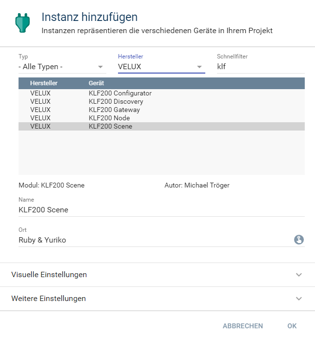

  

   

  

# Velux KLF200 Discovery  <!-- omit in toc -->

## Inhaltsverzeichnis <!-- omit in toc -->

- [1. Funktionsumfang](#1-funktionsumfang)
- [2. Voraussetzungen](#2-voraussetzungen)
- [3. Software-Installation](#3-software-installation)
- [4. Einrichten der Instanzen in IP-Symcon](#4-einrichten-der-instanzen-in-ip-symcon)
- [5. Statusvariablen und Profile](#5-statusvariablen-und-profile)
- [6. PHP-Befehlsreferenz](#6-php-befehlsreferenz)
- [7. Aktionen](#7-aktionen)
- [8. Anhang](#8-anhang)
  - [1. Changelog](#1-changelog)
  - [2. Spenden](#2-spenden)
- [9. Lizenz](#9-lizenz)

## 1. Funktionsumfang

 - Auffinden von KLF200 im Netzwerk.  
 - Einfaches Anlegen von dem benötigten Konfigurator, Gateway und IO Instanzen.  
 
## 2. Voraussetzungen

 - IPS ab Version 6.0  
 - KLF200 io-homecontrol® Gateway  
    - KLF muss per LAN angeschlossen sein  
    - KLF Firmware 2.0.0.71 oder neuer  

## 3. Software-Installation

* Dieses Modul ist Bestandteil der [VeluxKLF200-Library](../README.md#3-software-installation).  
  
## 4. Einrichten der Instanzen in IP-Symcon

Eine einfache Einrichtung ist über diese Instanz möglich.  
Bei der installation aus dem Store wird das anlegen der Instanz automatisch angeboten.  

Bei der manuellen Einrichtung ist das Modul im Dialog `Instanz hinzufügen` unter den Hersteller `VELUX` zu finden.  
  

Alternativ ist es auch in der Liste alle Konfiguratoren aufgeführt.  
  

Über das selektieren eines Eintrages in der Tabelle und betätigen des dazugehörigen `Erstellen` Button,  
wird automatisch eine Konfigurator, Gateway und IO Instanz erzeugt.  

  

## 5. Statusvariablen und Profile

Dieses Modul erstellt keine Statusvariablen und Profile.  

## 6. PHP-Befehlsreferenz

Dieses Modul besitzt keine Instanzfunktionen.

## 7. Aktionen

Es gibt keine speziellen Aktionen für dieses Modul.  

## 8. Anhang

### 1. Changelog

[Changelog der Library](../README.md#2-changelog)

### 2. Spenden

  Die Library ist für die nicht kommerzielle Nutzung kostenlos, Schenkungen als Unterstützung für den Autor werden hier akzeptiert:  

 

## 9. Lizenz

  IPS-Modul:  
  [CC BY-NC-SA 4.0](https://creativecommons.org/licenses/by-nc-sa/4.0/)  
  