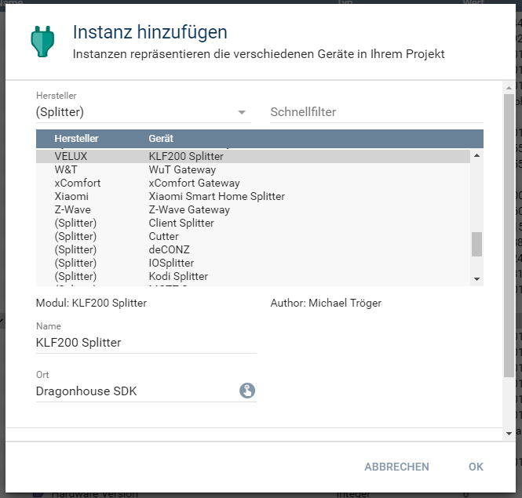
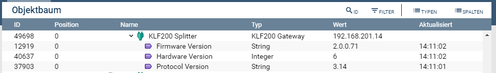

[](https://www.symcon.de/service/dokumentation/entwicklerbereich/sdk-tools/sdk-php/)
[](https://community.symcon.de/t/modul-velux-klf200/50429)
[](https://www.symcon.de/de/service/dokumentation/installation/migrationen/v55-v60-q3-2021/)  
[](https://creativecommons.org/licenses/by-nc-sa/4.0/)
[](https://github.com/Nall-chan/VeluxKLF200/actions) [](https://github.com/Nall-chan/VeluxKLF200/actions)  
[](#2-spenden)
[](#2-spenden)  

# Velux KLF200 Gateway  <!-- omit in toc -->

## Inhaltsverzeichnis <!-- omit in toc -->

- [1. Funktionsumfang](#1-funktionsumfang)
- [2. Voraussetzungen](#2-voraussetzungen)
- [3. Software-Installation](#3-software-installation)
- [4. Einrichten der Instanzen in IP-Symcon](#4-einrichten-der-instanzen-in-ip-symcon)
- [5. Statusvariablen und Profile](#5-statusvariablen-und-profile)
- [6. WebFront](#6-webfront)
- [7. PHP-Befehlsreferenz](#7-php-befehlsreferenz)
- [8. Aktionen](#8-aktionen)
- [9. Anhang](#9-anhang)
  - [1. Changelog](#1-changelog)
  - [2. Spenden](#2-spenden)
- [10. Lizenz](#10-lizenz)


## 1. Funktionsumfang

 - Bindeglied zwischen Netzwerk und IPS-Instanzen vom Type Node und Konfigurator.  
 - Auslesen und darstellen von Zuständes des KLF200.  

## 2. Voraussetzungen

 - IPS ab Version 6.0  
 - KLF200 io-homecontrol® Gateway  
    - KLF muss per LAN angeschlossen sein  
    - KLF Firmware 2.0.0.71 oder neuer  

## 3. Software-Installation

* Dieses Modul ist Bestandteil der [VeluxKLF200-Library](../README.md#3-software-installation).  

## 4. Einrichten der Instanzen in IP-Symcon

Eine einfache Einrichtung ist über die im Objektbaum unter `Discovery Instanzen` zu findende Instanz [KLF200 Discovery](../KLF200Discovery/README.md) möglich.  

Bei der manuellen Einrichtung ist das Modul im Dialog `Instanz hinzufügen` unter den Hersteller `VELUX` zu finden.  
  

Alternativ ist es auch in der Liste alle Splitter aufgeführt.  
  

In dem sich öffnenden Konfigurationsformular ist das Passwort einzutragen.  
``Das Standardkennwort ist dasselbe wie das auf der Rückseite des KLF200 angegebene WLAN-Kennwort.``  

## 5. Statusvariablen und Profile

 

**Statusvariablen:**  

| Name             | Typ     | Ident           | Beschreibung                                            |
| :--------------- | :------ | :-------------- | :------------------------------------------------------ |
| Hardware Version | integer | HardwareVersion | Hardware-Version des KLF200 Gateways.                   |
| Firmware Version | string  | FirmwareVersion | Firmware-Version des KLF200 Gateways.                   |
| Protocol Version | string  | ProtocolVersion | Version des aktuell unterstützen Protokolls des KLF200. |


**Profile:**  

Dieses Modul erstellt keine Profile.

## 6. WebFront

Sollen die vorhandene Statusvariablen im WebFront angezeigt werden, so müssen diese verlinkt werden.  

## 7. PHP-Befehlsreferenz

**Folgende Funktionen liefern 'TRUE' bei Erfolg.  
Im Fehlerfall wird eine Warnung erzeugt und 'FALSE' zurückgegeben.**  

```php
bool KLF200_RequestGatewayVersion(int $InstanzeID);
```
Liest die Hard- und Firmware Version des Gateways, und speichert das Ergebnis in den Statusvariablen.  
Wird automatisch beim Verbinden mit dem Gateway ausgeführt.  

```php
bool KLF200_RequestProtocolVersion(int $InstanzeID);
```
Liest die Protokoll Version des Gateways, und speichert das Ergebnis in der Statusvariable.  
Wird automatisch beim Verbinden mit dem Gateway ausgeführt.  

```php
bool KLF200_SetGatewayTime(int $InstanzeID);
```
Schreibt die UTC Zeit in das Gateway.  
Wird automatisch beim Verbinden mit dem Gateway ausgeführt.  

```php
array KLF200_GetGatewayTime(int $InstanzeID);
```
Liest die aktuelle Zeit aus dem Gateway, und liefert ein Array mit folgenden Feldern.  
Es wird keine lokale Uhrzeit, und keine Sommerzeit unterstützt. Das bool-Feld 'DaylightSavingFlag' wird immer false sein.   
```php
    'Timestamp',
    'Second',
    'Minute',
    'Hour',
    'DayOfMonth',
    'Month',
    'Year',
    'WeekDay',
    'DayOfYear',
    'DaylightSavingFlag'
```  

## 8. Aktionen

Es gibt keine speziellen Aktionen für dieses Modul.  

## 9. Anhang

### 1. Changelog

[Changelog der Library](../README.md#2-changelog)

### 2. Spenden

  Die Library ist für die nicht kommerzielle Nutzung kostenlos, Schenkungen als Unterstützung für den Autor werden hier akzeptiert:  

<a href="https://www.paypal.com/donate?hosted_button_id=G2SLW2MEMQZH2" target="_blank"></a>

[](https://www.amazon.de/hz/wishlist/ls/YU4AI9AQT9F?ref_=wl_share) 


## 10. Lizenz

  IPS-Modul:  
  [CC BY-NC-SA 4.0](https://creativecommons.org/licenses/by-nc-sa/4.0/)  