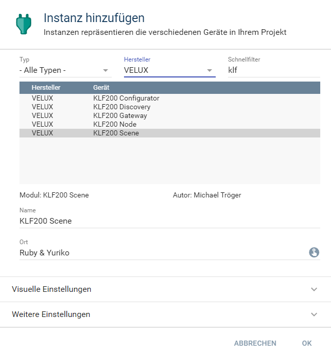

[](https://www.symcon.de/service/dokumentation/entwicklerbereich/sdk-tools/sdk-php/)
[](https://community.symcon.de/t/modul-velux-klf200/50429)
[](https://www.symcon.de/service/dokumentation/installation/migrationen/v54-v55-q4-2020/)  
[](https://creativecommons.org/licenses/by-nc-sa/4.0/)
[](https://github.com/Nall-chan/VeluxKLF200/actions) [](https://github.com/Nall-chan/VeluxKLF200/actions)  
[](#3-spenden)
[](#3-spenden)  

# Velux KLF200 Node  <!-- omit in toc -->

## Inhaltsverzeichnis <!-- omit in toc -->

- [1. Funktionsumfang](#1-funktionsumfang)
- [2. Voraussetzungen](#2-voraussetzungen)
- [3. Software-Installation](#3-software-installation)
- [4. Einrichten der Instanzen in IP-Symcon](#4-einrichten-der-instanzen-in-ip-symcon)
- [5. Statusvariablen und Profile](#5-statusvariablen-und-profile)
- [6. WebFront](#6-webfront)
- [7. PHP-Befehlsreferenz](#7-php-befehlsreferenz)
  - [Allgemein](#allgemein)
  - [Shutter](#shutter)
  - [Slats](#slats)
  - [Dimmer Light / Heating](#dimmer-light--heating)
- [8. Aktionen](#8-aktionen)
- [9. Anhang](#9-anhang)
  - [1. Changelog](#1-changelog)
  - [2. Spenden](#2-spenden)
- [10. Lizenz](#10-lizenz)

## 1. Funktionsumfang

  - Auslesen, darstellen und Steuern von Zuständen eines Gerätes.  
  - Bereitstellung von PHP-Funktionen.  

## 2. Voraussetzungen

 - IPS ab Version 5.5  
 - KLF200 io-homecontrol® Gateway  
    - KLF muss per LAN angeschlossen sein  
    - KLF Firmware 2.0.0.71 oder neuer  

## 3. Software-Installation

* Dieses Modul ist Bestandteil der [VeluxKLF200-Library](../README.md#3-software-installation).  

## 4. Einrichten der Instanzen in IP-Symcon

Eine einfache Einrichtung ist über die im Objektbaum unter `Konfigurator Instanzen` zu findene Instanz [KLF200 Konfigurator](../KLF200Configurator/README.md) möglich.  

Bei der manuellen Einrichtung ist das Modul im Dialog `Instanz hinzufügen` unter den Hersteller `VELUX` zu finden.  
  

In dem sich öffnenden Konfigurationsformular ist die `Node ID` des Gerätes einzutragen.  

## 5. Statusvariablen und Profile


Die Statusvariablen werden je nach Geräte-Typ des Nodes angelegt oder auch wieder entfernt.  
Es werden folgende Statusvariablen verwendet: 'MAIN', 'FP1', 'FP2' und 'FP3'.  
Dabei entsprechen die Werte und Aktionen dem jeweiligen Funktions-Parameter, welche bei jedem Geräte-Typ (NodeSubType) unterschiedlich sind.  
Entsprechend sind auch der Name und das Profil beim anlegen der Instanz je nach Geräte-Typ unterschiedlich.  

**Statusvariable MAIN:**  

| Name            | Typ     | Ident | Beschreibung                                              |
| :-------------- | :------ | :---- | :-------------------------------------------------------- |
| Status          | boolean | MAIN  | Licht                                                     |
| Schalter        | boolean | MAIN  | Aktoren                                                   |
| Schloss         | boolean | MAIN  | Schlösser                                                 |
| Position        | integer | MAIN  | Alle Geräte welche eine prozentuale Position unterstützen |
| Intensität      | integer | MAIN  | Dimmbares Licht                                           |
| Doppelrollladen | integer | MAIN  | Nur bei Doppelrollladen vorhanden                         |
| Geschlossen     | integer | MAIN  | prozentuale Schließung von Lüftungen/Heizungen            |

**Statusvariable FP1:**  

| Name           | Typ     | Ident | Beschreibung                        |
| :------------- | :------ | :---- | :---------------------------------- |
| Orientierung   | integer | FP1   | Ausrichtung von Lamellen in Prozent |
| Obere Position | integer | FP1   | Obere Position in Prozent           |

**Statusvariable FP2:**  

| Name            | Typ     | Ident | Beschreibung               |
| :-------------- | :------ | :---- | :------------------------- |
| Untere Position | integer | FP2   | Untere Position in Prozent |

**Statusvariable FP3:**  

| Name         | Typ     | Ident | Beschreibung                        |
| :----------- | :------ | :---- | :---------------------------------- |
| Orientierung | integer | FP3   | Ausrichtung von Lamellen in Prozent |

**Profile**:
 
| Name                        | Typ     | verwendet von Statusvariablen  (Ident) |
| :-------------------------- | :------ | :------------------------------------- |
| KLF200.Light.Reversed       | boolean | MAIN                                   |
| KLF200.Lock                 | boolean | MAIN                                   |
| KLF200.Blind                | integer | MAIN                                   |
| KLF200.RollerShutter        | integer | MAIN, FP1, FP2                         |
| KLF200.Window               | integer | MAIN                                   |
| KLF200.Garage               | integer | MAIN                                   |
| KLF200.Light.51200.Reversed | integer | MAIN                                   |
| KLF200.Intensity.51200      | integer | MAIN                                   |
| KLF200.Slats                | integer | FP1, FP3                               |

                                                                                                                                                               
## 6. WebFront

Die direkte Darstellung im WebFront ist möglich, es wird aber empfohlen mit Links zu arbeiten.  
Alle Statusvariablen sind auch bedienbar.  

## 7. PHP-Befehlsreferenz

Alle Funktionen liefern `TRUE` wenn das Gateway den Empfang des Befehls bestätigt hat.  
Anschließend führt das KLF200 die gewünschte Aktion aus.  
Im Fehlerfall, oder wenn das Gateway den Befehl ablehnt, wird eine Warnung erzeugt und `FALSE` zurückgegeben.  

Alle `$Value` Variablen vom Typ integer (int) haben eine Wertebereich von 0 (`0x000`) bis 51200 (`0xC800`) für absolute Werte.  

Es kann bei allen `$Value` Variablen vom Typ integer (int) auch eine Relative Ansteuerung erfolgen.
Hierzu ist der Wertebereich von 51456 (`0xC900`) für -100% bis zu 53456 (`0xD0D0`) für +100% reserviert.  

---  

### Allgemein

```php
bool KLF200_RequestStatus(int $InstanzeID)
```
Stellt eine Anfrage über den aktuellen Status des Node an das Gateway.  

```php
bool KLF200_RequestNodeInformation(int $InstanzeID)
```
Stellt eine Anfrage über Informationen zum Node an das Gateway.  

```php
bool KLF200_SetMainParameter(int $InstanzeID, int $Value)
```
Main Parameter auf `$Value` setzen.  

```php
bool KLF200_SetFunctionParameter1(int $InstanzeID, int $Value)
```
Function Parameter 1 auf `$Value` setzen.  

```php
bool KLF200_SetFunctionParameter2(int $InstanzeID, int $Value)
```
Function Parameter 2 auf `$Value` setzen.  

```php
bool KLF200_SetFunctionParameter3(int $InstanzeID, int $Value)
```
Function Parameter 3 auf `$Value` setzen.  

```php
bool KLF200_SwitchMode(int $InstanzeID, bool $Value)
```
Gerät wird auf den in `$Value` übergebenen Wert ein/ausgeschaltet bzw. komplett geschlossen/geöffnet.  

---  

### Shutter

Betrifft alle Gerätetypen, welche eine prozentuale Ansteuerung für Positionen bieten.  

```php
bool KLF200_ShutterMove(int $InstanzeID, int $Value)
```
Gerät auf in den `$Value` übergebenen Wert setzen.  

```php
bool KLF200_ShutterMoveUp(int $InstanzeID)
```
Öffnungsbefehl an das Gerät senden.  

```php
bool KLF200_ShutterMoveDown(int $InstanzeID)
```
Schließbefehl an das Gerät senden.  

```php
bool KLF200_ShutterMoveStop(int $InstanzeID)
```
Stop Befehl an das Gerät senden.  

---  

### Slats

```php
bool KLF200_OrientationSet(int $InstanzeID, int $Value)
```
Öffnungswinkel auf den in `$Value` übergebenen Wert setzen.  

```php
bool KLF200_OrientationUp(int $InstanzeID)
```
Öffnungswinkel auf 0 setzen.  

```php
bool KLF200_OrientationDown(int $InstanzeID)
```
Öffnungswinkel auf maximum setzen.  

```php
bool KLF200_OrientationStop(int $InstanzeID)
```
Stop Befehl an das Gerät senden.  

---  

### Dimmer Light / Heating

```php
bool KLF200_DimSet(int $InstanzeID, int $Value)
```
Setzten den Dimmwert auf den in `$Value` übergebenen Wert.  

```php
bool KLF200_DimUp(int $InstanzeID)
```
Setzten den Dimmwert auf das Maximum.  

```php
bool KLF200_DimDown(int $InstanzeID)
```
Setzten den Dimmwert auf das Minimum.  

```php
bool KLF200_DimStop(int $InstanzeID)
```
Stop Befehl an das Gerät senden.  

## 8. Aktionen

Es gibt keine speziellen Aktionen für dieses Modul.  

## 9. Anhang

### 1. Changelog

[Changelog der Library](../README.md#2-changelog)

### 2. Spenden

  Die Library ist für die nicht kommerzielle Nutzung kostenlos, Schenkungen als Unterstützung für den Autor werden hier akzeptiert:  

<a href="https://www.paypal.com/donate?hosted_button_id=G2SLW2MEMQZH2" target="_blank"></a>

[](https://www.amazon.de/hz/wishlist/ls/YU4AI9AQT9F?ref_=wl_share) 


## 10. Lizenz

  IPS-Modul:  
  [CC BY-NC-SA 4.0](https://creativecommons.org/licenses/by-nc-sa/4.0/)  