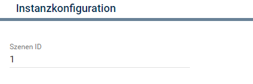

[](https://www.symcon.de/service/dokumentation/entwicklerbereich/sdk-tools/sdk-php/)
[](https://community.symcon.de/t/modul-velux-klf200/50429)
[](https://www.symcon.de/de/service/dokumentation/installation/migrationen/v55-v60-q3-2021/)  
[](https://creativecommons.org/licenses/by-nc-sa/4.0/)
[](https://github.com/Nall-chan/VeluxKLF200/actions) [](https://github.com/Nall-chan/VeluxKLF200/actions)  
[](#2-spenden)
[](#2-spenden)  

# Velux KLF200 Scene  <!-- omit in toc -->

## Inhaltsverzeichnis <!-- omit in toc -->

- [1. Funktionsumfang](#1-funktionsumfang)
- [2. Voraussetzungen](#2-voraussetzungen)
- [3. Software-Installation](#3-software-installation)
- [4. Einrichten der Instanzen in IP-Symcon](#4-einrichten-der-instanzen-in-ip-symcon)
- [5. Statusvariablen und Profile](#5-statusvariablen-und-profile)
- [6. WebFront](#6-webfront)
- [7. PHP-Befehlsreferenz](#7-php-befehlsreferenz)
  - [Allgemein](#allgemein)
- [8. Aktionen](#8-aktionen)
- [9. Anhang](#9-anhang)
  - [1. Changelog](#1-changelog)
  - [2. Spenden](#2-spenden)
- [10. Lizenz](#10-lizenz)

## 1. Funktionsumfang

  - Starten einer Scene.  

## 2. Voraussetzungen

 - IPS ab Version 6.0  
 - KLF200 io-homecontrol® Gateway  
    - KLF muss per LAN angeschlossen sein  
    - KLF Firmware 2.0.0.71 oder neuer  

## 3. Software-Installation

* Dieses Modul ist Bestandteil der [VeluxKLF200-Library](../README.md#3-software-installation).  

## 4. Einrichten der Instanzen in IP-Symcon

Eine einfache Einrichtung ist über die im Objektbaum unter `Konfigurator Instanzen` zu findene Instanz [KLF200 Konfigurator](../KLF200Configurator/README.md) möglich.  

Bei der manuellen Einrichtung ist das Modul im Dialog `Instanz hinzufügen` unter den Hersteller `VELUX` zu finden.  
  

In dem sich öffnenden Konfigurationsformular ist die `Node ID` des Gerätes einzutragen.  
  

**Konfigurationsseite (Parameter)**  

| Name    | Text      |
| ------- | --------- |
| SceneId | Szenen ID |

## 5. Statusvariablen und Profile

Folgende Statusvariablen werden erstellt:

**Statusvariablen:**  

| Name            | Typ     | Ident    | Beschreibung                                         |
| :-------------- | :------ | :------- | :--------------------------------------------------- |
| Szene           | integer | Execute  | Startet die Szene                                    |
| Geschwindigkeit | integer | Velocity | Geschwindigkeit mit welcher die Szene gestartet wird |

**Profile**:
 
| Name            | Typ     | verwendet von Statusvariablen  (Ident) |
| :-------------- | :------ | :------------------------------------- |
| KLF200.Scene    | integer | Execute                                |
| KLF200.Velocity | integer | Velocity                               |

                                                                                                                                                               
## 6. WebFront

Die direkte Darstellung im WebFront ist möglich, es wird aber empfohlen mit Links zu arbeiten.  
Alle Statusvariablen sind auch bedienbar.  

## 7. PHP-Befehlsreferenz

Alle Funktionen liefern `TRUE` wenn das Gateway den Empfang des Befehls bestätigt hat.  
Anschließend führt das KLF200 die gewünschte Aktion aus.  
Im Fehlerfall, oder wenn das Gateway den Befehl ablehnt, wird eine Warnung erzeugt und `FALSE` zurückgegeben.  

---  

### Allgemein

```php
bool KLF200_StartScene(int $InstanzeID, int $Velocity)
```
Startet eine Szene mit der Geschwindigkeit 0 bis 2;

## 8. Aktionen

Es gibt keine speziellen Aktionen für dieses Modul.  

## 9. Anhang

### 1. Changelog

[Changelog der Library](../README.md#2-changelog)

### 2. Spenden

  Die Library ist für die nicht kommerzielle Nutzung kostenlos, Schenkungen als Unterstützung für den Autor werden hier akzeptiert:  

<a href="https://www.paypal.com/donate?hosted_button_id=G2SLW2MEMQZH2" target="_blank"></a>

[](https://www.amazon.de/hz/wishlist/ls/YU4AI9AQT9F?ref_=wl_share) 


## 10. Lizenz

  IPS-Modul:  
  [CC BY-NC-SA 4.0](https://creativecommons.org/licenses/by-nc-sa/4.0/)  