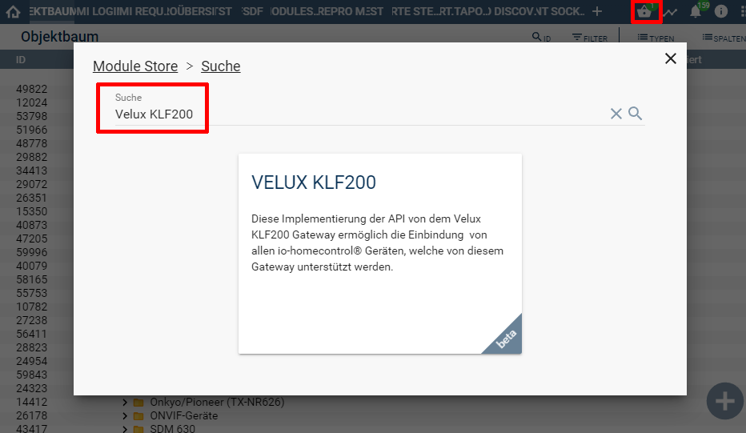

  

   

  
# VeluxKLF200 <!-- omit in toc -->

Diese Implementierung der API von dem Velux KLF200 Gateway
ermöglicht die Einbindung von allen io-homecontrol® Geräten, welche von diesem Gateway unterstützt werden.  

## Dokumentation <!-- omit in toc -->

**Inhaltsverzeichnis**

- [1. Funktionsumfang](#1-funktionsumfang)
  - [KLF200 Discovery](#klf200-discovery)
  - [KLF200 Configurator](#klf200-configurator)
  - [KLF200 Gateway](#klf200-gateway)
  - [KLF200 Node](#klf200-node)
  - [KLF200 Scene](#klf200-scene)
- [2. Voraussetzungen](#2-voraussetzungen)
- [3. Software-Installation](#3-software-installation)
- [4. Einrichten der Instanzen in IP-Symcon](#4-einrichten-der-instanzen-in-ip-symcon)
- [5. Anhang](#5-anhang)
  - [1. GUID der Module](#1-guid-der-module)
  - [2. Changelog](#2-changelog)
  - [3. Spenden](#3-spenden)
- [6. Lizenz](#6-lizenz)

## 1. Funktionsumfang

### [KLF200 Discovery](KLF200Discovery/README.md)  
 - Auffinden von KLF200 im Netzwerk und Anlegen der Konfigurator-Instanz inklusive Gateway in IPS.  

### [KLF200 Configurator](KLF200Configurator/README.md)  
 - Einfaches Anlegen von Geräte-Instanzen in IPS.  
  
### [KLF200 Gateway](KLF200Gateway/README.md)  
 - Bindeglied zwischen dem KLF200 und den Geräte und Konfigurator-Instanzen.  
  
### [KLF200 Node](KLF200Node/README.md)  
  - Bildet ein Gerät (Node) des KLF200 in Symcon ab.  

### [KLF200 Scene](KLF200Scene/README.md)  
  - Bildet eine Szene des KLF200 in Symcon ab.  
  -   
## 2. Voraussetzungen

 - IPS 6.0 oder höher  
 - KLF200 io-homecontrol® Gateway  
    - KLF200 muss per LAN angeschlossen sein  
    - KLF200 Firmware 2.0.0.71 oder neuer   

## 3. Software-Installation

  Über den `Module-Store` in IPS das Modul `VELUX KLF200` hinzufügen.  
   **Bei kommerzieller Nutzung (z.B. als Errichter oder Integrator) wenden Sie sich bitte an den Autor.**  
  

## 4. Einrichten der Instanzen in IP-Symcon

Details sind direkt in der Dokumentation der jeweiligen Module beschrieben.  
Es wird empfohlen die Einrichtung mit der Discovery-Instanz zu starten ([KLF200 Discovery:](KLF200Discovery/README.md)).  

## 5. Anhang

###  1. GUID der Module
 
 
| Modul               | Typ          | Prefix | GUID                                   |
| ------------------- | ------------ | ------ | -------------------------------------- |
| KLF200 Discovery    | Discovery    | KLF200 | {3F7261B4-04E3-4FF5-98D3-41ED2AD9548D} |
| KLF200 Configurator | Configurator | KLF200 | {38724E6E-8202-4D37-9FA7-BDD2EDA79520} |
| KLF200 Gateway      | Splitter     | KLF200 | {725D4DF6-C8FC-463C-823A-D3481A3D7003} |
| KLF200 Node         | Device       | KLF200 | {4EBD07B1-2962-4531-AC5F-7944789A9CE5} |
| KLF200 Scene        | Device       | KLF200 | {4E0650E4-2CDE-47A1-99F8-2C695FAC25E7} |

### 2. Changelog

 Version 1.03:
 - Node-Instanz hat die Rückmeldung von COMMAND_SEND_CFM und STATUS_REQUEST_CFM falsch ausgewertet.  
 - Neue Scenen-Instanzen werden im Konfigurator angezeigt.  

 Version 1.02:
 - Timeout auf 10 Sekunden erhöht.  
 - Neue Scenen-Instanz.  

 Version 1.00:
 - Doku aktualisiert.  
 - Discovery Instanz hinzugefügt.  
 - Internen Datenaustausch überarbeitet, da einige Events nicht in den Node Instanzen verarbeitet wurden.  
 - Node Instanzen können automatisch den Namen aus dem KLF200 übernehmen.  
 - Node Instanz hat bool Werte invertiert abgebildet.  
 - Node Instanz zeigt an ob ein Node arbeitet oder nicht.  
 - Node Instanz führt den aktuellen Status nach, wenn sich die Gateway Instanz verbindet.  
 - Node Instanz schreibt den Grund der letzten Aktivierung in eine Statusvariable. (**Wind & Regensensor**)  
 - Node Instanz kann jetzt auch auf dem Zustand vom Gerät warten.  
 - KLF200_OrientationUp, KLF200_OrientationDown und KLF200_OrientationStop waren defekt.  
 - Konfigurator sucht nicht mehr nach neuen Nodes, sondern verarbeitet nun Events des Gateway um Geräte zu erkennen.  
 - Gateway Instanz fragt aktuellen Zustand der Nodes beim verbinden an.  
 - **Gateway Instanz trennt die Verbindung zum KLF200 wenn Symcon runtergefahren wird.** (Eigene Shutdown-Skripte auf dem ClientSocket können damit kollidieren!)  
 - Gateway Instanz kann beim beenden von Symcon das KLF200 neustarten.  
 - Gateway Instanz sendet alle 5 Minuten anstatt 10 Minuten eine Anfrage an das KLF200 um einen Timeout der Verbindung zu vermeiden.  

 Version 0.71:
 - Fehlermeldung wenn Timeout beim Verbindungsaufbau auftrat.  
 - Gateway zeigte beim Symcon start verbunden an, auch wenn ClientSocket gestört war.  

 Version 0.7:
 - PTLS entfernt.  
  
 Version 0.6:
 - Button im Splitter für das Lesen der Firmwareversion war ohne Funktion.  
 - Fehler im Konfigurator, wenn Namen der Geräte einen Umlaut enthielt.  
 - Der Konfigurator hat eine neuen Button, um im laufenden Betrieb die Geräteliste neu zu laden.  

 Version 0.5:  
 - Öffentliche Betaversion  
 - Dokumentation erstellt  

 Version 0.1:  
 - Testversion  

### 3. Spenden  
  
  Die Library ist für die nicht kommerzielle Nutzung kostenlos, Schenkungen als Unterstützung für den Autor werden hier akzeptiert:  

  

 

## 6. Lizenz

  [CC BY-NC-SA 4.0](https://creativecommons.org/licenses/by-nc-sa/4.0/)  